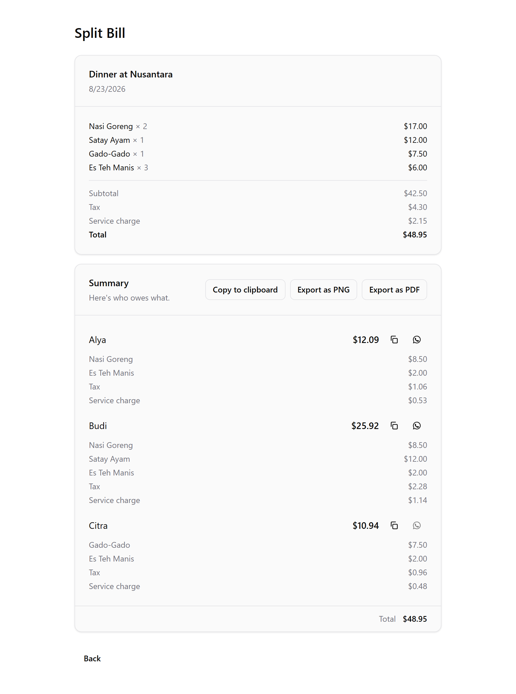

# Split Bill

[](https://github.com/nafuza1299/split-bill-app/actions/workflows/ci.yml)

> Portfolio project by [nafuza1299](https://github.com/nafuza1299). Live: [split-ur-bill.vercel.app](https://split-ur-bill.vercel.app/) · Source: [github.com/nafuza1299/split-bill-app](https://github.com/nafuza1299/split-bill-app) · [MIT License](LICENSE).

[](https://split-ur-bill.vercel.app/)

A wizard for splitting a shared bill — a restaurant receipt, groceries, a group order — between a
group of people. Add everyone, enter the line items with tax and service charge, then split evenly
or assign each item to whoever ordered it. The summary shows exactly what each person owes and can
be copied as text, sent to one person over WhatsApp, or exported as a PNG or PDF.

No backend, no accounts, no network calls: the whole thing runs in the browser and remembers your
in-progress receipt for a day. The interesting part isn't the wizard — it's making the arithmetic
come out exactly right, which is covered under "What this actually demonstrates" below.

**Stack:** Vite + React 19 + TypeScript, [catalyst-ui](../catalyst-ui) (personal component library)
vendored for the UI primitives, Zustand + `persist` for state, Zod for validation, Tailwind v4,
html-to-image + jsPDF for the exports.

## Running it

```bash
npm install
npm run dev           # dev server
npm test              # vitest (unit)
npm run test:e2e      # playwright (end-to-end, no network)
npm run test:coverage # vitest + v8 coverage, 80% per-file gate
npm run build         # typecheck + production build
```

## What this actually demonstrates

A bill splitter looks like a form with a division at the end. What doesn't come for free:

- **The cents always add up.** Dividing $33.50 three ways gives $11.166…, and rounding each share
  independently either loses or invents a cent — the classic split-the-bill bug where the parts
  don't sum to the whole. `calculateSplit` (`src/lib/splitCalculator.ts`) uses largest-remainder
  (Hamilton) apportionment: floor every share, then hand the leftover cents to whoever has the
  largest fractional remainder. The per-person totals sum *exactly* to the grand total, minus
  anything nobody claimed — an unassigned item is billed to no one rather than being quietly
  smeared across the group.

- **Tax and service follow what you ordered.** In assign mode they aren't split evenly; each
  person's share is proportional to their share of the item subtotal, so the person who ordered the
  $20 main carries twice the tax of the person who ordered the $10 salad. Splitting the surcharges
  evenly while splitting the items by assignment is the subtle wrong answer that looks right.

- **Money is integer cents from end to end**, parsed once at the input boundary and never held as a
  float. That pushes the hard part into the text field: `MoneyInput` formats thousands separators
  live *while you type*, which normally throws the caret to the end of the line every time a comma
  appears. It instead counts the digits before the cursor, reformats, and re-anchors the caret after
  that same digit (`countDigitsBefore` / `indexAfterDigits` in `src/lib/money.ts`).

- **Persistence expires.** A half-entered receipt surviving a reload is useful; last Tuesday's dinner
  reappearing when you open the app is not. `createExpiringStorage` (`src/lib/cache.ts`) wraps
  `localStorage` in a `savedAt` envelope and returns `null` past a one-day TTL, so the store
  rehydrates clean instead of stale.

- **A blocked Next button says why it's blocked.** `canAdvance` and `getAdvanceBlockedReason`
  (`src/store/useReceiptStore.ts`) are pure functions over the state, unit-tested as a matrix per
  step, and the disabled button carries the reason in a tooltip rather than leaving you to guess
  which field is wrong.

- **The tests are split by what each layer can actually prove.** 208 Vitest tests cover the logic and
  components under an 80% *per-file* coverage gate. The nine Playwright specs deliberately only
  cover what jsdom cannot: the real canvas capture behind the PNG/PDF export (mocked outright in the
  unit tests), the `localStorage` round-trip through the TTL wrapper, the native `confirm()` behind
  "Clear all", and the WhatsApp popup — plus an axe-core WCAG 2.0/2.1 A+AA scan. Both run in CI on
  every push.

## Build order

The commit history follows the build: scaffold, then the vendored `catalyst-ui` primitives, then
validation and the money input before any splitting logic existed. The receipt card and text
formatting came next, then the PNG/PDF export, then the first test pass. Persistence with its TTL,
"Clear all", the blocked-step tooltips, currency selection and WhatsApp sharing were each added as
self-contained slices afterwards, with the end-to-end suite and CI last — once there was a full
flow worth driving in a real browser.

## Known trade-offs

- **`catalyst-ui` is vendored into `src/components/catalyst`** rather than installed, since it isn't
  published as a package. It carries its own tests in its own repo and is excluded from this
  project's Vitest run and coverage thresholds; app-owned primitives live in `src/components/ui`
  and are covered normally.
- **Every amount displays with two decimal places**, including zero-decimal currencies — JPY shows
  as `¥20.00`. Storage is cents-based throughout, and pinning the display to two decimals keeps the
  formatted output consistent with what is actually stored rather than rounding differently per
  currency.
- **Nothing is shareable as a live link.** State lives only in the viewer's `localStorage`, so
  sharing a split means sharing the text, the PNG or the PDF. A backend would fix that, and would
  also be the only way to let people settle up against each other.
- **`tesseract.js` is still in `dependencies` but nothing imports it** — a receipt-OCR scan was
  scoped and not built. It should come out, or the feature should land.
